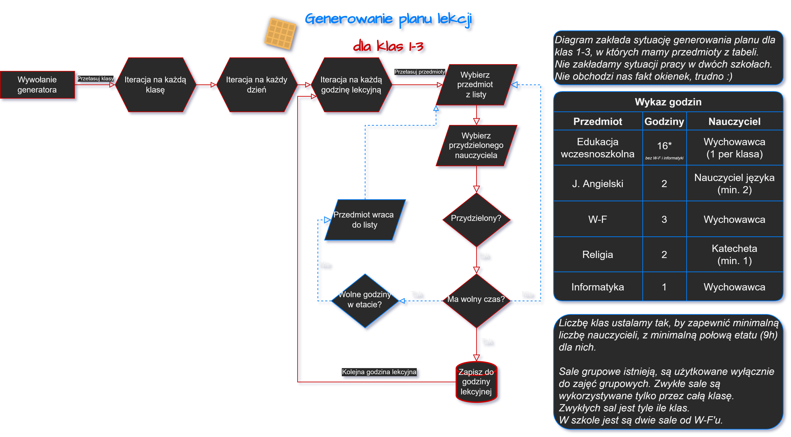

# TimetablePlanner
---
### Proces generowania planu
1. Iteracja po wszystkich klasach
2. Iteracja po każdej godzinie lekcyjnej
3. Dobór przedmiotu i nauczyciela
4. Sprawdzenie czy przydzielony nauczyciel jest wolny
5. Wpisanie przedmiotu do planu
6. Powrót do punktu 2



---

### Wymagania
- Python 3.10+

<details>
<summary>Pakiety</summary>

```yml
Placeholder
Placeholder
```

</details>

---

### To-Do

<details>
<summary>Wersja 1.0</summary>

#### 1. Baza danych
> - [x] Tabele:
>   - [x] Nauczyciele
>   - [x] Przedmioty
>   - [x] Klasy
>   - [x] Sale
>   - [x] Plan lekcji
> - [x] Wprowadzenie zabezpieczeń przed idiotyczną zmianą danych / Walidacja danych
> - [x] MS Access -> SQL -> phpMyAdmin
> - [x] Dostęp z serwera
> - [x] Wprowadzenie samych danych

#### 2. Generator
> - [x] Generowanie planu na gotowych danych
> - [ ] Przydzielanie sali do klasy na bazie:
>   - [x] wolnych sal
>   - [ ] liczby osób
>   - [ ] sali "klasowej" aka sala przydzielona do danej klasy
> - [x] Przydzielenie nauczyciela do klasy na bazie etatu
> - [x] Przedmioty wychowawcy
>   - 0 = Dowolny nauczyciel przedmiotu
>   - 1 = Wychowawca
> - [x] Połączenie z bazą danych
> - [ ] Zapis danych tymczasowo jako XML/JSON
> - [ ] Komunikacja przez PyScript

#### 3. Strona
> - [ ] Prototyp wyglądu strony na bazie placeholderowych tabelek
> - [ ] Panel wprowadzania danych do bazy (?)
> - [ ] Umożliwienie przeglądu danych z bazy
> - [ ] Połączenie z bazą danych
> - [ ] Wyświetlenie danych na czysto lub odczytanie z XML/JSON (?)
> - [ ] Wyświetlenie danych w tabeli
> - [ ] Panel wyboru
>   - [ ] Klasy
>   - [ ] Nauczyciela
>   - [ ] Sali

</details>

<details>
<summary>Wersje 1.1 - 1.9</summary>

> - [ ] Nauczyciele z więcej niż jednym przedmiotem
> - [ ] Automatyczne przydzielenie wychowawcy (opcjonalna funkcja)
> - [ ] Lekcje grupowe
> - [ ] Walidacja danych w sposób bardzo rozległy

</details>

<details>
<summary>Wersja 2.0</summary>

> - [ ] Rework wszystkiego bo dlaczego nie
> - [ ] Wsparcie roczników IV - VIII
> - [ ] Wsparcie klas ukierunkowanych
> - [ ] Etaty

</details>

<details>
<summary>Wersja 3.0</summary>

> - [ ] Wsparcie dla szkół średnich
> - [ ] Wersja w bardziej zoptymalizowanym języku (JS?)
> - [ ] Generator zastępstw

</details>